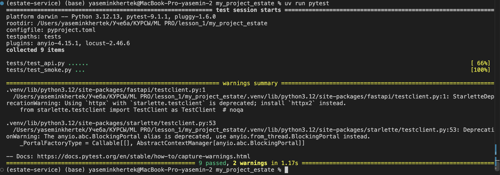
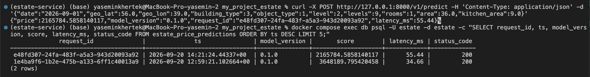
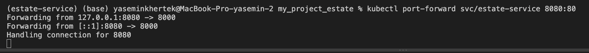
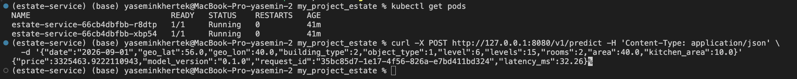
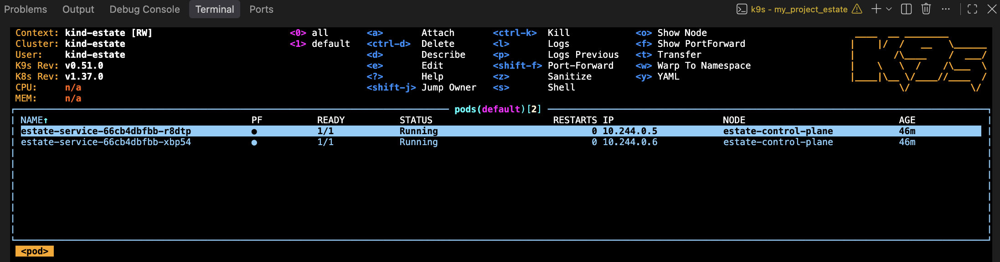
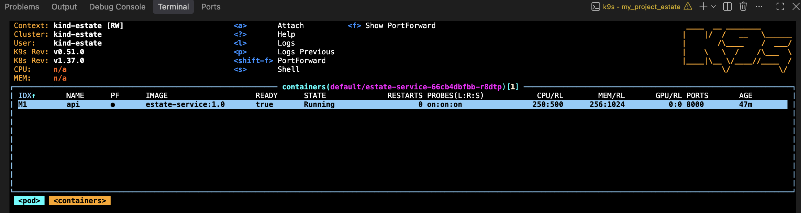
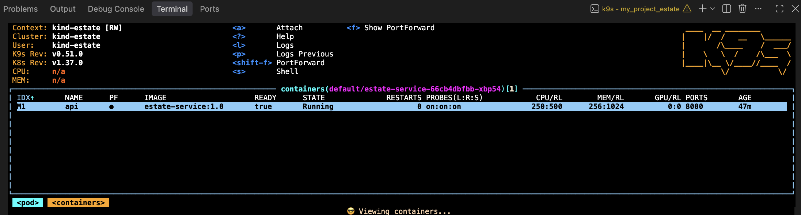

# ML PRO 2026. ДЗ № 1

(свой сервис от артефакта до кластера)

## ML-проект: estate-service - оценка стоимости жилья в Мск (регрессия)

- Модель: RandomForest на датасете Яндекс.Недвижимость ([Russia Real Estate 2018–2021](https://www.kaggle.com/datasets/mrdaniilak/russia-real-estate-20182021), регион 81).
- Препроцессинг и модель собраны в один sklearn `Pipeline`.
- Бандл `artifact/model.joblib` = `{pipeline, metadata}`.
- Ноутбук обучения: [research/baseline.ipynb](research/baseline.ipynb),
  скрипт: [src/estate/ml/train.py](src/estate/ml/train.py).
- Сервис на FastAPI: `/health`, `/ready`, `/v1/predict`, автодоки на `/docs`.
  Каждый запрос к `/v1/predict` логируется в Postgres (таблица `estate_price_predictions`,
  в том числе `status_code`). Без `DATABASE_URL` сервис работает, но не логирует.

## Проверка

```bash
# 1. Тесты
uv sync && uv run pytest

# 2. Compose: сервис + Postgres
docker compose up -d --build

# 3. Kubernetes в kind
kind create cluster --name estate && docker build -t estate-service:1.0 . && kind load docker-image estate-service:1.0 --name estate && kubectl apply -f k8s/ && kubectl rollout status deploy/estate-service
```

Пример запроса:

```bash
curl -X POST http://127.0.0.1:8000/v1/predict -H 'Content-Type: application/json' \
  -d '{"date":"2026-09-01","geo_lat":55.0,"geo_lon":39.0,"building_type":3,"object_type":1,"level":7,"levels":9,"rooms":2,"area":54.0,"kitchen_area":10.0}'
```

Логи в базе:

```bash
docker compose exec db psql -U estate -d estate \
  -c "SELECT request_id, ts, model_version, score, latency_ms, status_code FROM estate_price_predictions ORDER BY ts DESC LIMIT 5;"
```

## Структура

```
artifact/model.joblib      # бандл: pipeline + metadata
research/baseline.ipynb    # исследование и подбор параметров (ноутбук обучения)
src/estate/
  config.py                # настройки окружения (pydantic-settings)
  db.py                    # DDL и запись лога в Postgres
  ml/preprocess.py         # FeatureEngineer, load_data
  ml/train.py              # обучение и сохранение бандла
  service/app.py           # FastAPI-сервис
tests/                     # контракт, smoke, детерминизм
dockerfile, compose.yaml
k8s/deployment.yaml, k8s/service.yaml
```

## Отчёт

### Скрины

1. pytest:
   
2. SELECT из логов:
   
3. get pods & ответ predict через port‐forward:
   Терминал 1:

   

   Терминал 2:

   
4. Скрин k9s с подами:
   k9s:

   

   Pod 1:

   

   Pod 2:

   

### Журнал проблем

(что не завелось с первого раза: текст ошибки → как починили)

**Артефакт**

1. Бандл, сохранённый из ноутбука, ссылался на `__main__.FeatureEngineer` — в сервисе
   `AttributeError: Can't get attribute 'FeatureEngineer' on <module '__main__'>`.
   → Класс перенесён в модуль `estate/ml/preprocess.py`. Правило: любой перенос модуля препроцессинга = переобучение и проверка `type(pipeline.named_steps['features']).__module__`.
2. `transform` удалял строки (`dropna`, гео-фильтр) → внутри `Pipeline.fit`
   `ValueError: Found input variables with inconsistent numbers of samples`.
   → Фильтрация вынесена в `load_data()` до сплита, в `transform` только заполнение пропусков и `assert len(out) == len(X)`.
3. Бандл весил 504 МБ (`n_estimators=200` из RandomizedSearchCV), а затем 92 МБ. Для репозитория это много → пренебрегли качеством модели ради скорости деплоя `n_estimators=60, max_depth=10`: model.joblib стал 3 МБ

**Проект на uv**

6. `uv sync` падал из-за `dependency-groups = [...]` - неккоректный синтаксис
   → переписано в `[dependency-groups]` с `dev = [...]`; `shap`, `jupyter` перенесены в dev.
7. `uv sync` не разрешал зависимости из-за некорректно указанной версии `scikit-learn`→ `scikit-learn>=1.6,<1.7`

**Сервис**

8. `predict_proba` у регрессора (скопировано из churn):
   `AttributeError: 'RandomForestRegressor' object has no attribute 'predict_proba'`.
   → заменено на корректный `predict(frame)[0]`.
9. Первый живой ответ: `"price": 15.79` при статусе 200 — модель отдавала лог-шкалу → обернуто в `np.expm1(...)`, стало 7 228 898 руб.
10. Границ у полей не было: `area=-100, level=99` → статус 200 и «прогноз».
    → определены диапазоны через `Field(ge/le)` по p1/p99 региона, добавлен `model_validator` для `level <= levels`
    и `kitchen_area < area`, `date: datetime.date` вместо `str`.
11. `status_code` в логе всегда был 200. → обернула `predict` в `try/except`, теперь при ошибке с `score=None, status_code=500`; в DDL у `score` снят `NOT NULL`.

**Kubernetes**

15. Синтаксис: пробы были вложены внутрь `resources`, а не на уровень контейнера → исправлены отступы и имена.

## Дополнительная часть (Звездочки)

### 1 Нагрузочное тестирование (Locust)

Сценарий — [locustfile.py](locustfile.py): 90% запросов `POST /v1/predict`, 10% `GET /health`,
пауза 0.1–0.5 с. Нагрузка на compose-версию (один uvicorn-процесс), три прогона по 60 с.
CSV-отчёты Locust — в [load/](load/).


| users |  RPS | median, ms | p95, ms | max, ms | ошибки |
| ----: | ---: | ---------: | ------: | ------: | -----------: |
|    10 | 30.4 |         22 |      44 |      97 |     0 / 1796 |
|    50 | 92.1 |        230 |     400 |     560 |     0 / 5442 |
|   100 | 89.8 |        870 |    1000 |    1255 |     0 / 5303 |

```bash
uv run locust -f locustfile.py --headless -u 10  -r 5  -t 60s --csv load/run10  -H http://127.0.0.1:8000
uv run locust -f locustfile.py --headless -u 50  -r 10 -t 60s --csv load/run50  -H http://127.0.0.1:8000
uv run locust -f locustfile.py --headless -u 100 -r 20 -t 60s --csv load/run100 -H http://127.0.0.1:8000
```

**Выводы.** На 10 пользователях сервис работает без очереди: медиана 22 мс ≈ времени одного `predict`. Уже на 50 пользователях p95 оторвался от медианы не так сильно
(400 vs 230), но сама медиана выросла в 10 раз, запросы стоят в очереди. Максимум сервиса около 90 RPS. При переходе от 50 к 100 пользователям RPS не вырос (92 → 90). Ошибок не было ни в одном прогоне - сервис деградирует по латентности, но не по доступности. Чтобы поднять RPS, нужно больше воркеров uvicorn или реплик за балансировщиком.

### 2 Батч-эндпоинт

ручка `POST /v1/predict/batch`, схема `{"rows": [Features, ...]}`, от 1 до 1000 строк. Все строки собираются в один `DataFrame`, `pipeline.predict` вызывается один раз, ответ - список цен в порядке `rows`. Пустой список выдает статус 422. Тесты в  `test_batch_matches_single`, `test_batch_empty_is_422`.

Замер `latency_ms` из ответа сервиса (compose), медиана из 10 повторов:


| строк | median, ms |
| ---------: | ---------: |
|          1 |       18.7 |
|        100 |       17.8 |
|        500 |       17.8 |
|       1000 |       19.5 |

**Вывод:**500 строк стоят примерно столько же, сколько одна (~18 мс). Почти все время уходит на фиксированные накладные расходы: построение `DataFrame`, `FeatureEngineer.transform`(pandas), обход 60 деревьев в sklearn — это векторизованные операции, где стоимость первой строки и следующих одинакова; сам проход по деревьям для 500 объектов занимает доли миллисекунды.

### 3 Выкат новой версии и откат

Образ `estate-service:1.1` = сервис с батч-эндпоинтом и `version="1.1"` .

```bash
docker build -t estate-service:1.1 .
kind load docker-image estate-service:1.1 --name estate
kubectl set image deploy/estate-service api=estate-service:1.1
kubectl rollout status deploy/estate-service
kubectl rollout undo deploy/estate-service
kubectl rollout history deploy/estate-service
```

`kubectl get pods -w` во время выката (полный лог — [load/rollout_pods.log](load/rollout_pods.log)):

```
estate-service-66cb4dbfbb-r8dtp   1/1   Running             0   80m
estate-service-66cb4dbfbb-xbp54   1/1   Running             0   80m
estate-service-598d97c47-jttwb    0/1   Pending             0   0s
estate-service-598d97c47-jttwb    0/1   ContainerCreating   0   0s
estate-service-598d97c47-jttwb    0/1   Running             0   1s
estate-service-598d97c47-jttwb    1/1   Running             0   6s
estate-service-66cb4dbfbb-r8dtp   1/1   Terminating         0   80m
estate-service-598d97c47-n56kw    0/1   Pending             0   0s
estate-service-598d97c47-n56kw    0/1   ContainerCreating   0   0s
estate-service-598d97c47-n56kw    1/1   Running             0   6s
estate-service-66cb4dbfbb-xbp54   1/1   Terminating         0   80m
```

`rollout history` после отката:

```
REVISION  CHANGE-CAUSE
2         <none>
3         <none>
```

Проверка через port-forward: после `set image` `/openapi.json` отдаёт `version: 1.1` и
`/v1/predict/batch` отвечает. После `undo` - `version: 1.0`, батча в схеме нет, оба пода на образе `estate-service:1.0`.

**Что происходило:** Deployment делал RollingUpdate, те создал один новый под, дождался, пока тот пройдёт `startupProbe` и `readinessProbe`, и только потом убил один старый, затем то же со вторым. В каждый момент времени как минимум один под был `1/1 Ready` и принимал трафик через Service, поэтому сервис не молчал. 

**Проблема:** После `rollout undo` `kubectl port-forward` перестал отвечать (`HTTP 000`):
туннель привязан к конкретному поду, а тот был удалён при откате. Исправляется  перезапуском `port-forward` - это ограничение туннеля, не сервиса.
